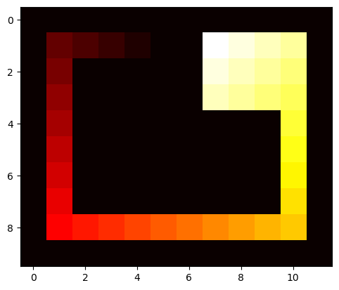
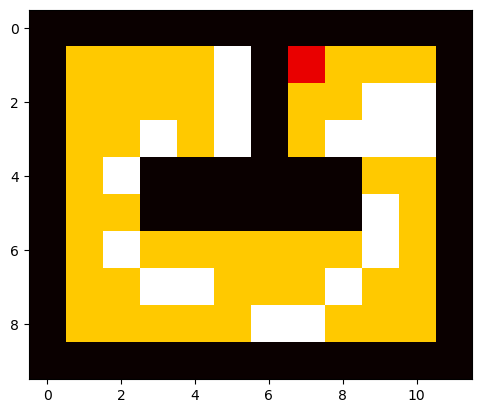
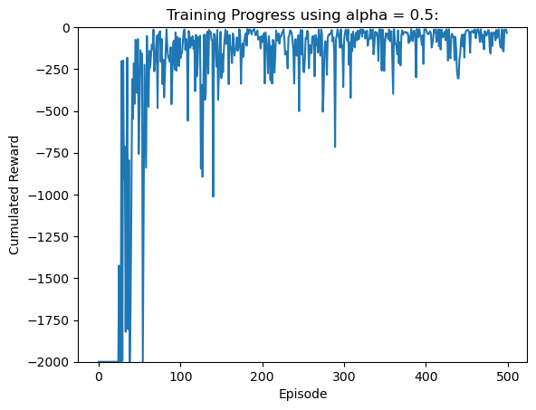
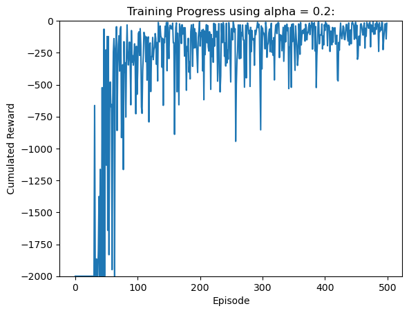
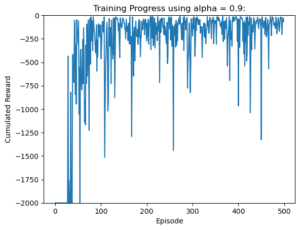
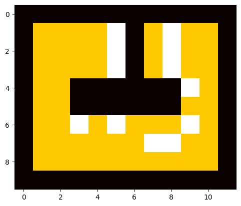
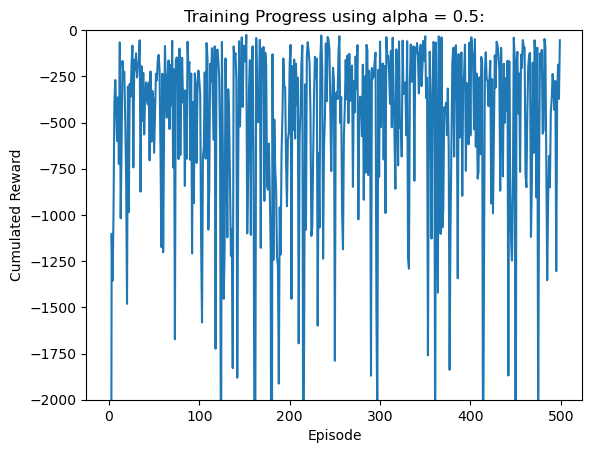
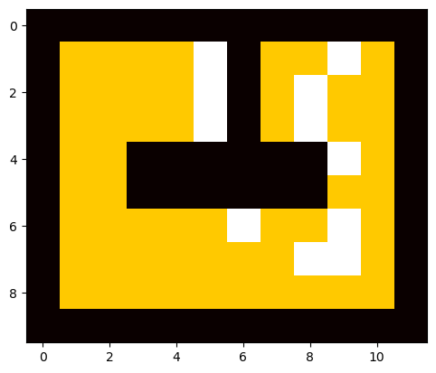
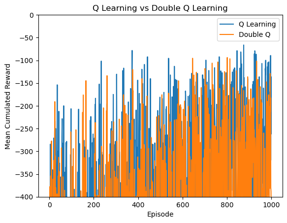

# Temporal Difference (TD) Learning

This module transitions to **Temporal Difference (TD) learning** to solve the more difficult "Rectangular Course" (4 turns). TD methods allow the agent to learn from incomplete episodes, making them suitable for larger state spaces and sparse rewards.

## **1. TD Prediction (TD(0))**
We compared TD prediction against the previous MC approach.
*   **Process:** Implemented the TD(0) update rule: $V(s) \leftarrow V(s) + \alpha [R + \gamma V(s') - V(s)]$.
*   **Outcome:** Convergence was slower than MC for this specific deterministic task, as reward information propagates backward one step per episode.

## **2. Sarsa (On-Policy Control)**
We implemented Sarsa to solve the control problem.
*   **Process:** The agent updates its Q-values based on the action it *actually* takes (including $\varepsilon$-exploration risks).
*   **Outcome:** The agent learned a **conservative/safe policy**, driving down the middle of the track to avoid hitting walls during random exploration events.

*Figure 1: Cumulative reward over 500 episodes using Sarsa.*

## **3. Q-Learning (Off-Policy Control)**
We implemented Q-Learning to find the theoretically optimal path.
*   **Process:** The agent updates Q-values based on the *best possible* future action ($\max Q$), ignoring current exploration risks.
*   **Outcome:** The agent learned an **aggressive/optimal policy**, cutting corners tightly to maximize reward, assuming optimal future execution.

## **4. Double Q-Learning (Stochastic Environments)**
We addressed the "Drunk Driver" scenario where rewards are noisy (Stochastic).
*   **Process:** Implemented Double Q-Learning using two split Q-tables ($Q_1, Q_2$) to decouple action selection from evaluation, aiming to reduce **Maximization Bias**.
*   **Outcome:** While Standard Q-Learning learned faster (due to optimistic bias driving exploration), Double Q-Learning provided a more stable and unbiased estimation of state values, albeit with slower convergence.

*Figure 2: Comparison of Mean Cumulative Reward: Standard Q-Learning vs. Double Q-Learning.*